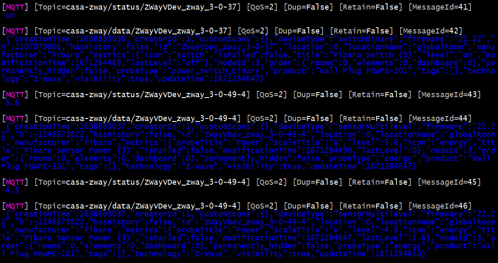

# mqttmon - A simple MQTT console monitor #

## What is MQTT ? ##

**MQTT** is a lightweight, publish-subscribe, machine to machine network messaging protocol. It's commonly used for telemetry, home automation and process control. You need a **MQTT broker**, which will forward messages between subscribers. 

## What is mqttmon ? ##

**mqttmon.py** is a simple MQTT monitor written in Python. It connects to a MQTT broker, subscribes to all topics, and displays all the MQTT messages on the console, with ANSI color formatting.

## How to use it ? ##

This is an early version. You must set the IP address of your MQTT broker in the source code :

> MQTT_BROKER = "tcp:192.168.1.2:1883"

Then, run the **mqttmon.py** in a shell. It will connect to the MQTT broker, and display all the MQTT messages continuously, in a readable form, with colors. 

Type **_Ctrl+C_** to abort. 

## Requirements ##

Language :
- Python 3.x

Python libraries (instal with **pip**) :
- twisted (Python asynchronous framework)
- twisted-mqtt (MQTT library for Twisted framework)

## Author ##

This software is (c) Toussaint OTTAVI, TK1BI, bc-109 Soft.

Mail : [t.ottavi@medi.fr](mailto:t.ottavi@medi.fr)

## License ##

This is free software: you can redistribute it and/or modify it under the terms of the GNU General Public License as published by the Free Software Foundation, either version 3 of the License, or (at your option) any later version.

This program is distributed in the hope that it will be useful, but WITHOUT ANY WARRANTY; without even the implied warranty of MERCHANTABILITY or FITNESS FOR A PARTICULAR PURPOSE.  See the GNU General Public License for more details.

You should have received a copy of the GNU General Public License along with this program.  If not, see <http://www.gnu.org/licenses/>.

